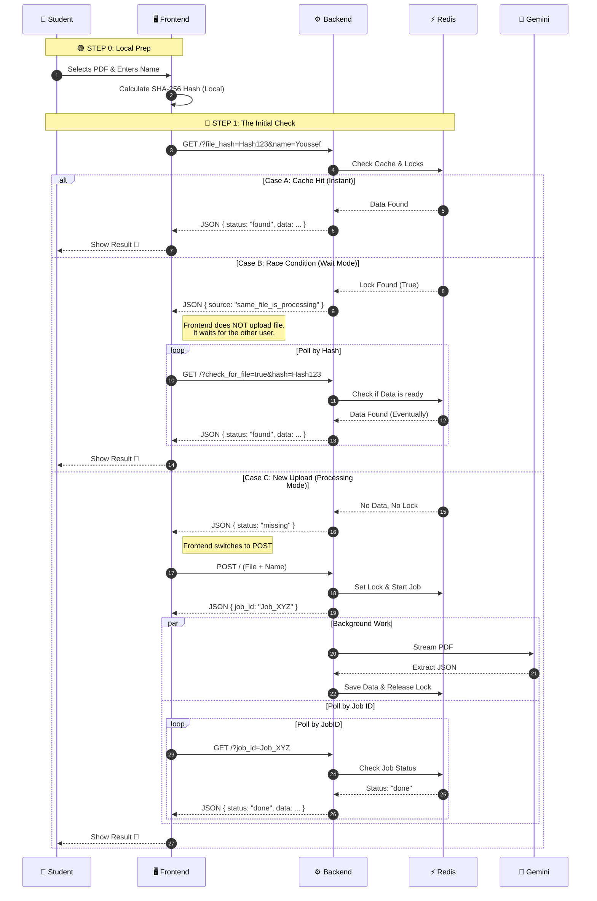

# 🎓 EMSI Exam Seat Finder (API)
### 🔴 **Live Demo:** [https://student-find-seat.vercel.app/](https://student-find-seat.vercel.app/)
A high-performance, asynchronous Distributed System designed to help EMSI students find their exam seats instantly. It uses **AI (Google Gemini)** to extract data from image-based PDFs and **Redis** to handle high-concurrency traffic during exam periods.

## ⚡ The Problem

During exam periods, thousands of students rush to download the same PDF schedules. These PDFs often contain **images** (scans) instead of selectable text, making `Ctrl+F` impossible. Students waste time scrolling through hundreds of pages to find their names.

## 🚀 The Solution

This API provides an intelligent backend that:

1. **Extracts** student data from scanned PDFs using Computer Vision/AI.
2. **Deduplicates** work: If 500 students upload the same PDF, the server processes it **only once**.
3. **Caches** results: Subsequent searches are instant (0ms processing time).

## 🏗️ System Architecture & Workflow

This project is built with **Express.js** and uses **Redis** for distributed locking and caching. It implements a **Polling Architecture** to handle long-running AI tasks without timing out.

### 🔄 The "Content-Addressing" Logic

Instead of relying on filenames (which users change), the Frontend calculates a **SHA-256 Hash** of the file content. This serves as the unique "Fingerprint" for the document.

### Scenario A: The "First Uploader" (Cold Start)

*When a student uploads a new PDF that the server has never seen before:*

1. **Hash Check:** Frontend sends the file hash. Server confirms: *"I don't know this file."*
2. **Upload:** Frontend uploads the PDF.
3. **Ticket System:** Server returns a `job_id` immediately (Non-blocking) and starts a **Background Worker**.
4. **AI Processing:** The worker streams the PDF buffer to **Google Gemini 1.5 Flash** to extract structured data (JSON).
5. **Polling:** The Frontend polls the server every 2 seconds (`GET /?job_id=...`).
6. **Completion:** Once Gemini finishes, data is saved to Redis, and the polling returns the result.

### Scenario B: The "Crowd" (Race Conditions & Deduplication)

*When 50 students try to process the same PDF at the same time:*

1. **Global Lock:** The first upload sets a lock in Redis (`processing:FILE_HASH`).
2. **Smart Wait:** When the other 49 students try to upload, the server detects the lock.
3. **Traffic Control:** instead of processing the file 50 times (wasting $$$ on AI costs), the server tells the students: *"Someone is already processing this. Wait."*
4. **Auto-Resolve:** The 49 students automatically poll Redis. The moment the first job finishes, **everyone** gets the result simultaneously.

---

## 🛠️ Tech Stack

* **Runtime:** Node.js v20+
* **Framework:** Express.js (Transitioned from Google Cloud Functions)
* **Database / Cache:** Upstash Redis (Serverless)
* **AI Engine:** Google Gemini 1.5 Flash
* **File Handling:** Busboy (Stream-based multipart parser)
* **Security:** `dotenv` for environment variables, standard CORS policies.

---

## 📦 Installation & Setup

### 1. Clone the repository

```bash
git clone https://github.com/YOUR_USERNAME/emsi-locator-api.git
cd emsi-locator-api

```

### 2. Install Dependencies

```bash
npm install

```

### 3. Environment Variables

Create a `.env` file in the root directory:

```env
PORT=8080
API_SECRET=your_secret_password
GOOGLE_API_KEY=your_gemini_api_key
UPSTASH_REDIS_REST_URL=your_upstash_url
UPSTASH_REDIS_REST_TOKEN=your_upstash_token

```

### 4. Run Locally

```bash
# Production mode
npm start

# Development mode (with auto-restart)
npm run dev

```

---

## 📡 API Endpoints

### `POST /` (Upload & Process)

Accepts a PDF file and starts the background job.

* **Header:** `x-api-secret: <your_secret>`
* **Body (Multipart):** `file` (PDF), `student_name` (String)
* **Response:** `{ "status": "processing", "job_id": "uuid..." }`

### `GET /` (Poll Status & Check Cache)

Checks if a file is already processed or if a specific job is done.

* **Query Params:**
* `job_id`: Check status of a specific upload.
* `check_for_file=true` & `file_hash`: Check global cache/lock status.


* **Response:** JSON containing status (`found`, `processing`, `missing`) and student data if found.

---

## 🛡️ Robustness Features

* **File Size Limit:** Streams act as a gatekeeper, instantly rejecting files > 5MB to prevent RAM spikes.
* **Error Handling:** Busboy streams are monitored for "unexpected end of form" errors to prevent server crashes.
* **Type Safety:** Strict checks for `multipart/form-data` headers.

---

## 👤 Author

**Youssef Ghafir**

* *Software Engineer Student at EMSI (4IIR)*
* [Portfolio](https://yg-20.netlify.app/)
* [LinkedIn](https://www.google.com/search?q=https://www.linkedin.com/in/youssef-ghafir-82a868237/)
